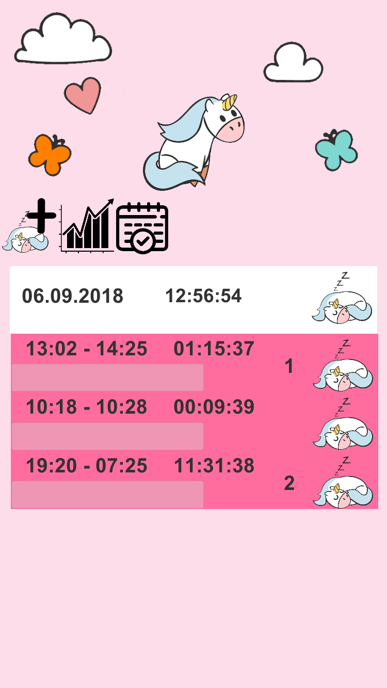

# Sleep Tracking

Playground to learn basics of unity UI. As my daughter was not the best sleeper in her first year, I developed as simple sleep tracker. It offers an overview how many hours the kid slept during one day.

Each sleep record (start / stop) is grouped into a sleep phase as long as there is no bigger gap than two hours. If the kid is awake for more than two hours, its counted as a new sleep phase.

Each sleep record belongs to one sleep phase
Each sleep phase belongs to a day (from 6pm to 6 pm the next day)

## Features
- start and stop Sleep Phase
- add manual sleep record
- edit sleep record
- delete sleep record
- show statistics (max sleep duration)
- group sleep records by day and sleep phase

## Impressions

